# Stack Tag 🏷️

> **Decentralized Identity & Achievement Platform on Stacks Blockchain**

Stack your achievements, tag your identity, and showcase your proof-of-work in the decentralized cosmos. Stack Tag is the ultimate platform for claiming `.btc` domains and managing verifiable Soulbound Tokens (SBTs) on the Stacks blockchain.

---

## 🎥 Demo Video

[](https://youtube.com/watch?v=YOUR_VIDEO_ID)

*Click to watch the full platform walkthrough*

---

## 📸 Platform Screenshots

### 🏠 Home Page - Claim Your .btc Domain
[](https://your-image-link.com)

### 👤 Profile Page - Showcase Your Identity
[](https://your-image-link.com)

### 📊 Dashboard - Manage SBTs & Social Links
[](https://your-image-link.com)

---

## 🚀 Features

### 🏷️ **Domain Management**
- **Claim .btc Domains**: Secure your unique identity on Stacks blockchain
- **20 STX Payment**: Fair pricing with blockchain verification
- **Instant Profiles**: Automatic profile creation after domain claim
- **Multiple Domains**: One wallet can claim multiple usernames

### 🏆 **Soulbound Token (SBT) System**
- **Import SBTs**: Add your achievements with image upload
- **Send SBTs**: Recognize others by sending achievement tokens
- **IPFS Storage**: Permanent, decentralized metadata storage
- **Rich Metadata**: Images, descriptions, and personal messages
- **Blockchain Secured**: True ownership via Stacks NFT standard

### 🔗 **Social Integration**
- **Multi-Platform Links**: Twitter, GitHub, Farcaster, Base, Lens, Instagram
- **Clickable Icons**: Direct links to your social profiles
- **Profile Customization**: Personalized bio and display settings
- **Social Proof**: Connect your digital identity across platforms

### 🌐 **Decentralized Infrastructure**
- **Stacks Blockchain**: Built on Bitcoin's security model
- **IPFS Storage**: Permanent, censorship-resistant data
- **Leather Wallet**: Seamless wallet integration
- **Smart Contracts**: Transparent, verifiable operations

---

## 🛠️ Tech Stack

### **Frontend**


### **Backend**


### **Blockchain & Storage**


### **Development Tools**


---

## 🏗️ Architecture Flow

```mermaid
graph TD
    A[🌐 User Browser] --> B[⚡ React Frontend]
    B --> C[🔗 Leather Wallet]
    B --> D[🖥️ Express Server]
    
    D --> E[🗄️ MongoDB]
    D --> F[📎 IPFS/Pinata]
    D --> G[⛓️ Stacks Blockchain]
    
    G --> H[💰 Fee Gate Contract]
    G --> I[🏆 SBT Transfer Contract]
    
    C --> G
    
    J[👤 Domain Claim] --> K[💳 20 STX Payment]
    K --> L[✅ Blockchain Verification]
    L --> M[📝 Profile Creation]
    
    N[🏆 SBT Import/Send] --> O[📤 IPFS Upload]
    O --> P[⛓️ Contract Call]
    P --> Q[👤 Profile Update]
    
    style A fill:#3b82f6
    style G fill:#5546ff
    style F fill:#65c2cb
    style E fill:#47a248
```



---

## 🚀 Quick Start

### Prerequisites
- **Node.js** 20.19+ ([Download](https://nodejs.org/))
- **MongoDB** ([Download](https://www.mongodb.com/try/download/community) or use [Atlas](https://cloud.mongodb.com/))
- **Leather Wallet** ([Install](https://leather.io/))
- **Pinata Account** ([Sign up](https://pinata.cloud/))

### 1. Clone Repository
```bash
git clone https://github.com/your-username/stack-tag.git
cd stack-tag
```

### 2. Server Setup
```bash
cd server
npm install

# Create environment file
cp .env.example .env
# Edit .env with your configuration
```

**Server Environment Variables:**
```env
PORT=5000
MONGO_URI=mongodb://localhost:27017/stack_tag
PINATA_JWT=your_pinata_jwt_token
PINATA_GATEWAY=https://gateway.pinata.cloud
STACKS_NETWORK=testnet
STACKS_CORE_API=https://stacks-node-api.testnet.stacks.co
SBT_CONTRACT_ADDRESS=your_contract_address
SBT_CONTRACT_NAME=sbt-transfer
```

### 3. Client Setup
```bash
cd ../client
npm install

# Create environment file
cp .env.example .env
# Edit .env with your configuration
```

**Client Environment Variables:**
```env
VITE_API_BASE=http://localhost:5000
VITE_STACKS_NETWORK=testnet
VITE_BNS_CONTRACT_ADDRESS=your_contract_address
VITE_BNS_CONTRACT_NAME=fee-gate
VITE_SBT_CONTRACT_ADDRESS=your_contract_address
VITE_SBT_CONTRACT_NAME=sbt-transfer
```

### 4. Deploy Smart Contracts
```bash
cd ../contracts

# Follow the SBT_DEPLOYMENT_GUIDE.md for detailed instructions
# Deploy via Hiro Platform (recommended) or CLI
```

### 5. Start Development Servers
```bash
# Terminal 1 - Server
cd server
npm run dev

# Terminal 2 - Client
cd client
npm run dev
```

### 6. Access Application
- **Frontend**: http://localhost:5173
- **Backend API**: http://localhost:5000
- **Health Check**: http://localhost:5000/api/health

---

## 📱 Usage Guide

### 🏷️ **Claiming a Domain**
1. Connect your Leather wallet
2. Enter desired username (3+ characters)
3. Pay 20 STX fee
4. Wait for blockchain confirmation
5. Access your profile at `/{username}/profile`

### 🏆 **Managing SBTs**
1. **Import SBT**: Dashboard → Import SBTs → Fill details + upload image
2. **Send SBT**: Dashboard → Send SBT → Enter recipient + SBT details
3. **View SBTs**: Visit any profile to see their achievements

### 🔗 **Social Links**
1. Go to Dashboard → Social Links
2. Add usernames for each platform
3. Links appear as clickable icons on your profile

---

## 🎯 Core Workflows

### Domain Claiming Flow
```
User Input → Wallet Connection → Payment (20 STX) → Blockchain Verification → Profile Creation → Success
```

### SBT Creation Flow
```
SBT Data → Image Upload (IPFS) → Metadata Upload (IPFS) → Database Storage → Profile Display
```

### SBT Sending Flow
```
Recipient Selection → SBT Creation → IPFS Upload → Recipient Profile Update → Success Notification
```

---

## 🌟 Platform Highlights

### ✨ **Unique Features**
- **True Ownership**: Blockchain-secured domains and SBTs
- **IPFS Integration**: Permanent, decentralized storage
- **Multi-Wallet Support**: Send SBTs to any Stacks address
- **Rich Metadata**: Images, messages, and attribution
- **Social Integration**: Connect all your digital identities

### 🔒 **Security & Decentralization**
- **Stacks Blockchain**: Built on Bitcoin's security model
- **Smart Contracts**: Transparent, verifiable operations
- **IPFS Storage**: Censorship-resistant data storage
- **Wallet Integration**: Non-custodial, user-controlled

### 🚀 **Performance & UX**
- **React 19**: Latest frontend technology
- **Modern UI**: Beautiful space-themed design
- **Real-time Updates**: Instant profile updates
- **Mobile Responsive**: Works on all devices

---

## 📊 Project Statistics

- **Smart Contracts**: 3 deployed contracts
- **API Endpoints**: 15+ RESTful endpoints
- **UI Components**: 20+ React components
- **Database Models**: Comprehensive user & SBT schemas
- **File Upload**: Image processing with IPFS
- **Authentication**: Wallet-based auth system

---

## 🏆 Built At

**Made with ❤️ at [Risein X Stacks Hackerhouse Goa](https://risein.com/hackathons/stacks-hackerhouse-goa)**

*Empowering developers to build the decentralized future on Stacks blockchain*

---

## 📄 License

This project is licensed under the MIT License - see the [LICENSE](LICENSE) file for details.

---

## 🔗 Links

- **Live Demo**: [StackTag](https://github.com/Nouman-wp/StackTag-HackerHouse-Goa)
- **Documentation**: [docs.stacks.co/](https://docs.stacks.co/)
- **Stacks Explorer**: [explorer.stacks.co](https://explorer.stacks.co/?chain=testnet)
- **IPFS Gateway**: [gateway.pinata.cloud](https://gateway.pinata.cloud)

---

<div align="center">

**Stack Tag** - *Decentralized Identity Made Simple* 🚀

[](https://stacks.org)
[](https://ipfs.io)
[](https://bitcoin.org)

</div>
